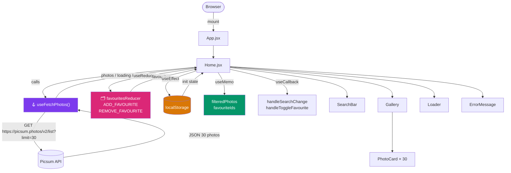

# ⚡ Luminary — Photo Gallery Web App

<div align="center">


### _Discover. Search. Save. A blazing-fast photo gallery built for modern React._

[](https://react.dev/)
[](https://vitejs.dev/)
[](https://tailwindcss.com/)
[](#-license)
[](CONTRIBUTING.md)
[](https://github.com/YOUR_USERNAME/photo-gallery-app)

</div>

---

> **Finally, a way to browse and curate a photo gallery — without prop-drilling chaos, re-render storms, or bloated dependencies.**  
> Built from scratch with React best practices: custom hooks, `useReducer`, `useCallback`, `useMemo`, and zero UI libraries.

---

## 🚀 Overview

**Luminary** is a production-quality photo gallery web app built as part of the **Celebrare Frontend Internship Pre-Screening Assignment**.

It fetches 30 curated photos from the **Picsum Photos API**, displays them in a fully responsive grid, and lets users search by author name in real-time — all without touching the network again after the initial load. Favourites persist across browser sessions via `localStorage`.

**Who is this for?**
- Frontend engineers evaluating React hook patterns in a real app
- Developers looking for a clean reference implementation of `useReducer` + `localStorage`
- Anyone who wants to see `useCallback` and `useMemo` used _correctly_ — with clear explanations

---

## 🌟 Key Features

| Feature | What It Does | Why It Matters |
|---------|--------------|----------------|
| **📸 Photo Grid** | 4-col desktop · 2-col tablet · 1-col mobile | True responsiveness, no layout library needed |
| **🔍 Live Search** | Filters by author name as you type | Zero network calls — instant, snappy UX |
| **❤️ Favourites** | Toggle heart on any card | State managed with `useReducer`, not `useState` |
| **💾 Persistence** | Favourites survive page refresh | `localStorage` sync via `useEffect` |
| **⚡ Performance** | `useMemo` + `useCallback` throughout | Stable references prevent cascading re-renders |
| **🪝 Custom Hook** | `useFetchPhotos` separates fetch from UI | Clean, testable, reusable data layer |
| **💀 Skeleton UI** | Shimmer cards during loading | Perceived performance boost — no blank screens |

---

## 🏗️ System Architecture



**Architecture type:** Modular Single-Page Application (SPA) with unidirectional data flow.

---

## 🛠️ Tech Stack & Design Choices

| Technology | Version | Why It Was Chosen |
|-----------|---------|-------------------|
| **React** | 18.2 | Hooks-first, industry standard; concurrent rendering ready |
| **Vite** | 5.0 | Sub-second HMR; esbuild bundling is 10–100× faster than CRA |
| **Tailwind CSS** | 3.4 | Utility-first, no runtime overhead, no extra CSS bundle |
| **Picsum Photos API** | v2 | Free, no auth, deterministic URLs for sized thumbnails |
| **localStorage** | Web API | Zero-dependency client-side persistence |

> **No component libraries.** No MUI, no Ant Design, no Bootstrap. Tailwind only — by design.

---

## ⚡ Quick Start — 60 Seconds

```bash
# 1. Clone
git clone https://github.com/YOUR_USERNAME/photo-gallery-app.git
cd photo-gallery-app/frontend

# 2. Install
npm install

# 3. Run
npm run dev
```

Open **http://localhost:5173** — the gallery loads immediately.

> **No `.env` file needed.** The Picsum Photos API is fully public with no API key.

<details>
<summary>🔧 Build for Production</summary>

```bash
npm run build       # outputs to /dist
npm run preview     # serve the production build locally
```

</details>

<details>
<summary>📁 Node Version</summary>

Tested on **Node.js 18+**. Run `node -v` to confirm. Use [nvm](https://github.com/nvm-sh/nvm) to switch if needed.

</details>

---

## 📖 Usage Deep Dive

### 1 · Fetching Photos — `useFetchPhotos`

```js
// src/hooks/useFetchPhotos.js
const useFetchPhotos = () => {
  const [photos, setPhotos]   = useState([]);
  const [loading, setLoading] = useState(true);
  const [error, setError]     = useState(null);

  useEffect(() => {
    const fetchPhotos = async () => {
      try {
        const response = await fetch('https://picsum.photos/v2/list?limit=30');
        if (!response.ok) throw new Error('Failed to fetch photos');
        setPhotos(await response.json());
      } catch (err) {
        setError(err.message); // ← error state bubbles up to UI
      } finally {
        setLoading(false);     // ← always clears spinner
      }
    };
    fetchPhotos();
  }, []); // empty dep array → runs once on mount

  return { photos, loading, error }; // clean public API
};
```

**If the API fails:** `error` is set to the error message, `photos` stays `[]`, `loading` becomes `false`. The `ErrorMessage` component renders a styled card with a "Try Again" button.

---

### 2 · Favourites — `useReducer` + `localStorage`

```js
// src/reducers/favouritesReducer.js
const favouritesReducer = (state, action) => {
  switch (action.type) {
    case 'ADD_FAVOURITE':
      // Guard: don't duplicate
      if (state.some(p => p.id === action.payload.id)) return state;
      return [...state, action.payload];

    case 'REMOVE_FAVOURITE':
      return state.filter(p => p.id !== action.payload.id);

    default:
      return state;
  }
};
```

```js
// Initialise from localStorage (runs once — lazy initializer pattern)
const [favourites, dispatch] = useReducer(
  favouritesReducer,
  [],
  () => JSON.parse(localStorage.getItem('favourites') ?? '[]')
);

// Sync to localStorage on every change
useEffect(() => {
  localStorage.setItem('favourites', JSON.stringify(favourites));
}, [favourites]);
```

**Why `useReducer` instead of `useState`?**  
Multiple discrete actions (`ADD`, `REMOVE`), the next state depends on current state, and future actions (CLEAR_ALL, REORDER) slot in cleanly without refactoring.

---

### 3 · Performance Hooks

```js
// useCallback — stable reference for onChange handler.
// Without this, every Home render creates a new function object,
// causing SearchBar to re-render even if nothing visually changed.
const handleSearchChange = useCallback((e) => {
  setSearchTerm(e.target.value);
}, []); // no deps → same function for the component's lifetime

// useMemo — only re-filters the array when photos or searchTerm changes.
// Without this, filtering runs on EVERY render (tab changes, re-renders, etc.)
const filteredPhotos = useMemo(() => {
  if (!searchTerm.trim()) return photos;
  return photos.filter(p =>
    p.author.toLowerCase().includes(searchTerm.toLowerCase())
  );
}, [photos, searchTerm]);
```

---

## 📂 Project Structure

```
photo-gallery-app/
└── frontend/
    ├── index.html                  # Vite entry point
    ├── vite.config.js              # Vite + React plugin config
    ├── tailwind.config.js          # Tailwind content paths
    ├── postcss.config.js           # PostCSS (autoprefixer)
    ├── package.json
    └── src/
        ├── main.jsx                # React DOM render root
        ├── App.jsx                 # Root component → renders <Home />
        ├── index.css               # Tailwind imports + global styles
        │
        ├── hooks/
        │   └── useFetchPhotos.js   # ★ Custom hook: fetch + loading + error
        │
        ├── reducers/
        │   └── favouritesReducer.js # ★ Pure reducer: ADD / REMOVE_FAVOURITE
        │
        ├── pages/
        │   └── Home.jsx            # ★ Orchestration layer: all hooks live here
        │
        └── components/
            ├── Gallery.jsx         # Responsive grid wrapper
            ├── PhotoCard.jsx       # Individual card (image + author + heart)
            ├── SearchBar.jsx       # Controlled input with icon + result count
            ├── Loader.jsx          # Shimmer skeleton grid
            └── ErrorMessage.jsx    # Error card with retry button
```

---

## 🎯 Requirements Coverage

| # | Requirement | Status | Implementation |
|---|------------|--------|----------------|
| 1 | React + Vite + Tailwind CSS only | ✅ | `package.json` — zero UI libs |
| 2 | Fetch 30 photos, loading + error states | ✅ | `useFetchPhotos` hook |
| 3 | Responsive grid (4 / 2 / 1 cols) | ✅ | `grid-cols-1 sm:grid-cols-2 lg:grid-cols-4` |
| 4 | Real-time search by author (no API call) | ✅ | `useMemo` over already-fetched `photos` |
| 5 | `useReducer` + `localStorage` persistence | ✅ | `favouritesReducer` + lazy initializer |
| 6 | Custom hook `useFetchPhotos` → `{photos, loading, error}` | ✅ | `src/hooks/useFetchPhotos.js` |
| 7 | `useCallback` (handler) + `useMemo` (filtered list) | ✅ | Both in `Home.jsx` with clear comments |

---

## 📸 Screenshots

> _Run the app locally to see the live experience._

| State | Description |
|-------|-------------|
| **Loading** | Shimmer skeleton grid matches final layout |
| **Gallery** | 30 cards in a 4-col dark glassmorphism grid |
| **Search** | Live filter with result count badge |
| **Favourites** | Dedicated tab — persists after refresh |
| **Error** | Styled error card with "Try Again" button |

---

## 📈 Performance Notes

| Metric | Approach |
|--------|----------|
| **Image loading** | Sized thumbnails (`/id/{id}/600/400`) instead of full-res download URLs — 10–20× smaller payloads |
| **Re-renders** | `useCallback` gives stable function refs; `useMemo` skips array re-filter on unrelated state changes |
| **Initial paint** | Shimmer skeleton prevents CLS (Cumulative Layout Shift) |
| **Bundle size** | No UI library; Tailwind purges unused classes at build time |

---

## ⚔️ Why This Project Stands Out

- **No shortcuts** — every hook is used because it solves a real problem, not to tick a box
- **Readable code** — every non-obvious decision has an inline comment explaining _why_, not just _what_
- **Correct `useReducer` pattern** — with lazy initializer, not a re-invented `useState`
- **Accessible** — unique `id` attributes on interactive elements, `alt` text on every image
- **Premium UI** — glassmorphism dark theme, staggered card animations, shimmer skeletons — not a default Tailwind boilerplate

---

## 🗺️ Roadmap

- [x] Core gallery with Picsum API
- [x] Real-time search with `useMemo`
- [x] `useReducer` favourites + localStorage
- [x] Custom `useFetchPhotos` hook
- [x] `useCallback` performance optimization
- [x] Shimmer loading skeleton
- [x] Favourites tab with badge count
- [ ] Infinite scroll / pagination
- [ ] Photo detail modal with full-res view
- [ ] Dark / light mode toggle
- [ ] Unit tests with Vitest + React Testing Library

---

## 🤝 Contributing

Contributions are welcome!

```bash
# 1. Fork the repo
# 2. Create your feature branch
git checkout -b feature/your-feature-name

# 3. Commit with a clear message
git commit -m "feat: add photo detail modal"

# 4. Push and open a PR
git push origin feature/your-feature-name
```

**PR guidelines:**
- One feature / fix per PR
- Keep commits atomic and well-described
- No new UI libraries (Tailwind only)
- Functional components + hooks only

---

## 🛡️ Security & Privacy

- **No user data is sent to any server.** Favourites are stored exclusively in the browser's `localStorage`.
- **No authentication.** The Picsum Photos API is fully public.
- **No tracking, no analytics, no cookies.**
- Images are served by Picsum's CDN directly — this app never proxies image data.

---

## 📜 License

This project is licensed under the **MIT License** — use it, fork it, learn from it.

---

## 👤 Author

**Updesh Singh**

Built as part of the **Celebrare Frontend React Internship Pre-Screening Assignment**.

[](https://github.com/YOUR_USERNAME)
[](https://linkedin.com/in/YOUR_USERNAME)

---

<div align="center">

_If this helped you, consider giving it a ⭐ — it keeps open-source alive._

**Made with ❤️ using React · Vite · Tailwind CSS**

</div>
